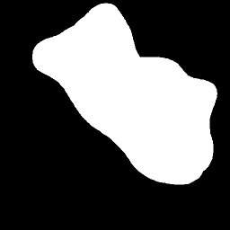
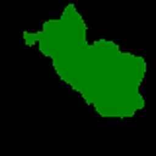

# Dataset Design Guidelines

Best practices for structuring defect classes and avoiding common pitfalls.

---

## ✓ Best Practices

### 1. Split Classes by Visual Characteristics

Separate defects by **color** and **shape** to ensure clear, distinct classes:

```
Good Class Design:
├── 0_dark_blue
├── 1_light_blue
├── 2_large_scratch
├── 3_thin_scratch

Poor Class Design (avoid):
├── blue_stuff
├── scratches_and_stuff
├── everything_else
```

- Separate by color: "A dark blue defect" vs. "A light blue defect"
- Separate by shape: "A large area scratch" vs. "A thin line scratch"
- Each class should have **visually consistent** samples

### 2. Use Specific, Descriptive Prompts

Semantic clarity directly affects generation quality:

| Prompt | Quality | Reason |
|--------|---------|--------|
| "A dark blue dry film residual defect" | ✓ Good | Specific color, context, defect type |
| "A large scratch covering PCB" | ✓ Good | Clear visual intent |
| "Blue defect" | ⚠️ Weak | Vague, missing context |
| "Defect" | ✗ Poor | Too generic, unstable generation |
| "Blue and scratchy thing" | ✗ Poor | Compound concepts confuse model |

### 3. Aim for Balanced, Sufficient Sample Counts

- **Target:** 50+ samples per class
- **Minimum:** 20 samples per class for stable generation
- **Distribution:** Roughly equal across classes (use weighted sampling if imbalanced)

### 4. Use Natural, Rough Masks

Masks do not need to be perfectly traced. **Hand-drawn masks are superior to pixel-perfect tracing** because they teach the model how defects naturally transition at edges.

**Visual Comparison:**

| Freehand Draw | LabelMe Tracing |
|---------------|-----------------|
|  |  |
| Natural, rough edges | Over-smooth, rigid boundaries |
| Reflects real defect uncertainty | Perfect pixel-level precision |
| **✓ RECOMMENDED** | ⚠️ Only as fallback |

**Why Freehand is Better:**
Real PCB defects have irregular, fuzzy edges. Teaching the model to accept and generate rough, natural boundaries helps it:
- Learn edge transition variability
- Generate more realistic, natural-looking defects
- Adapt to real defects with imperfect edges

**Best Practice:**
- Use **freehand drawing** (`pre_mask_utils.py`) for primary annotation
- Do **not** over-smooth or over-trace edges
- Allow natural, fuzzy boundaries in masks

---

## ✗ Pitfalls to Avoid

### 1. Mixing Visually Diverse Defects in One Class

**Problem:** Combining structurally different defects causes **generation collapse**

```
❌ BAD: "scratch_defect" class contains both:
   ├── Thin line scratches (1-2 pixels wide)
   └── Large area scratches (50+ pixels wide)
   → Result: Color distortion, texture degradation, unstable generation

✓ GOOD: Split into two classes:
   ├── "thin_scratch" (line-like, 1-2 pixels)
   └── "large_scratch" (area-like, 50+ pixels)
   → Result: Stable, controllable generation
```

**Fix:** Define classes by **visual homogeneity**, not defect type alone.

### 2. Too Many Classes with Few Samples

**Problem:** Minority classes produce **severely distorted outputs**

```
❌ BAD: 20 classes, 5 samples each
   → High variance, color confusion, poor generation

✓ GOOD: 5 classes, 50+ samples each
   → Stable generation, clear semantic boundaries
```

**Fix:** 
- Consolidate rare classes
- Collect more samples for minority classes
- Use weighted sampling during training (if imbalance is unavoidable)


## Next Steps

Once all checks pass:
1. **[Training Guide](training.md)** — Fine-tune SD Inpainting on your data
2. **[Inference Guide](inference.md)** — Generate synthetic defects
3. **[CNN Classifier Toolkit](https://github.com/Lien5757/cnn-classifier-gradio)** — Train classifier on mixed synthetic+real data
